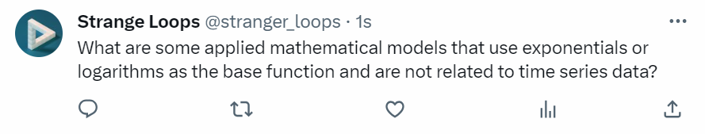

# logarithms

the change of base formula \\( \log_b(a) = \frac{\log_c(a)}{\log_c(b)} \\) works because ...
Inline math example: \\( e^{i\pi} + 1 = 0 \\)

Display math example:
\\[
e^{i\pi} + 1 = 0
\\]

 

    
    
rabbit population dynamics are commonly modeled with logarithms

from chipping away slowly at richard hamming's book, *the art of doing science and engineering*, one motif is the importance of understanding the fundamentals of math. choosing the base function for a modeling task is fundamental to understanding the nature of the problem, and i realized the family of logarithms and exponentials was an area where my intuition was weak. the lockdown lectures by youtube legend grant sanderson, the creator of 3blue1brown, were a great starting place.

---

notes on [logarithm fundamentals](https://www.youtube.com/watch?v=cevgcoyzvb4&list=plzhqobowtqdp5cveljj1bndouqrahvpev&index=7)
* traditional y-axes are additive (1, 2, 3, ...). if we instead make the y-axis multiplicative (1, 10, 100, ...), then the graphical representation of an exponential function is linear.

* inverse operations: (addition, subtraction), (multiplication, division), (exponentiation, logarithm)
  * properties of logarithms have corresponding exponentiation rules
  * the change of base formula $$log_b(a) = \frac{log_c(a)}{log_c(b)}$$ works because "anything additive in the logarithm realm is the same as anything multiplicative in terms of what is inside the parentheses"
* when extending the definition of logarithms to complex numbers, a bit more reasoning has to be done for a simple calculation $$ log_e(1) = 0, e^{2i\pi}, e^{4i\pi}, ... $$
* extending the idea of complex numbers in logarithms, we can define solutions to logarithms with negative bases and then leverage euler's formula to solve them.
* the last challenge question was cute, and here's an extended inductive proof showing that the statement is true for the general case of $$ n \geq 2$$.
 
$$
\frac{1}{log_2(100!)} + \frac{1}{log_3(100!)} + ... + \frac{1}{log_{100}(100!)} =? 
$$

inductive proof
* base case
$$ n = 2 \\
\frac{1}{log_2(2!)} = 1
$$
* inductive hypothesis

assuming 
$$
\frac{1}{log_2(k!)} + \frac{1}{log_3(k!)} + ... + \frac{1}{log_{k}(k!)} = 1 
$$ 
is true for $$n=k, k \geq 2$$

* recursive step

then, for $$n=k+1$$ , we have 
$$
\frac{1}{log_2((k+1)!)} + \frac{1}{log_3((k+1)!)} + ... + \frac{1}{log_{k+1}(k+1)!)} =? 
$$
$$
\frac{log(2)}{log((k+1)!)} + \frac{log(3)}{log((k+1)!)} + ... + \frac{log(k+1)}{log((k+1)!)} =? 
$$
$$
\frac{log(2*3*4*...*(k+1))}{log((k+1)!)} = 1$$

---

notes on [what makes the natural log "natural"](https://www.youtube.com/watch?v=4pdot7jtxmw&list=plzhqobowtqdp5cveljj1bndouqrahvpev&index=8)
* primes and the natural log are related. this part i still don't understand
* proof that $$ 1 + \frac{1}{2} + \frac{1}{3} + ... $$ is infinite
  * just group terms in increasing powers of two and show that each is greater than 1/2. this exponential grouping also shows the logarithmic growth of this series
* what is special about $e$? 
  * the most fundamental propert-e ;) is $$\frac{d}{dx} e^x = e^x$$. i.e. the rate of change at a point is equal to the y value at that point.
    * definition of a derivative: take $$ a^x$$ 
    * $$ a^x \cdot \lim_{h \to 0} \frac{a^h-1}{h} $$ 
    * e is defined to be the number such that this limit is 1 and thus $$e^x$$ is its own derivative
  * taylor series approach: $$e^x = 1 + x + \frac{x^2}{2!} + ...$$ 
* on the complex plane, the derivative of $$ e^{i\theta}$$ is $$ie^{i\theta} $$, so the slope at that point on the complex unit circle is always a rotation of $$\frac{\pi}{2}$$ of the vector and always of unit length. here, the base of *e* determines how fast around the origin a point is moving wheras *i* dictates the rotational property (this makes sense when plugging *i* into the taylor series to see why points don't blow up towards infinity as well).
* so we have $$ \frac{d}{dx}ln(x) = \frac{1}{x} $$ because $$\frac{dy}{dx} = \frac{1}{e^y}$$
  * therefore, $$1 + \frac{1}{2} + \frac{1}{3} + ... + \frac{1}{n} = ln(n) + \gamma$$ since the integral acts as an approximation for the riemman sum of the series.
* important principle: when it benefits a mathematician's, engineer's, or other professional's specific problem to generalize the form, it can benefit an entire community. 

---
summary
> fundamentally, when looking at which class of functions to use when modeling a scenario, logarithms and exponentials serve as the basis to problems where there is a *multiplicative relationship between variables*. for example, the distance a train travels at a constant velocity with respect to time, $$d=vt$$ is additive, in that during each time step, a constant amount is added onto the distance. however, charging and discharging a capcitor is intrinsically exponential and the charge can be represented by the general form $$q=ae^{-pt} + b$$ because during each time step, the charge changes proportionally to the current charge. it's natural to think of this in terms of the solution to the differential equation: $$v=r\frac{dq}{dt} + \frac{q}{c}$$ where $$c, r, v$$ are constants and we are trying to solve for *q*. this turns out to be a first-order linear non-homogeneous differential equation. as a more basic representation, the general solution to the first order ode $$y' = ky$$ is $$y=ce^{kt}$$ and is fundamentally exponential because the rate of change is proportional to the current value. so why would certain processes be intrinsically exponential or logarithmic? one idea is that systems where the ouput of a process becomes the input for the next iteration tend to be exponential/logarithmic in nature due to the relationship between the current value and rate of change. i'd be curious to hear people's encounters with logarithms and exponentials in the wild! if there are any errors or misunderstandings in this post, please feel free to reach out to me (contact information is in about page).

 

    
    
question tweet

