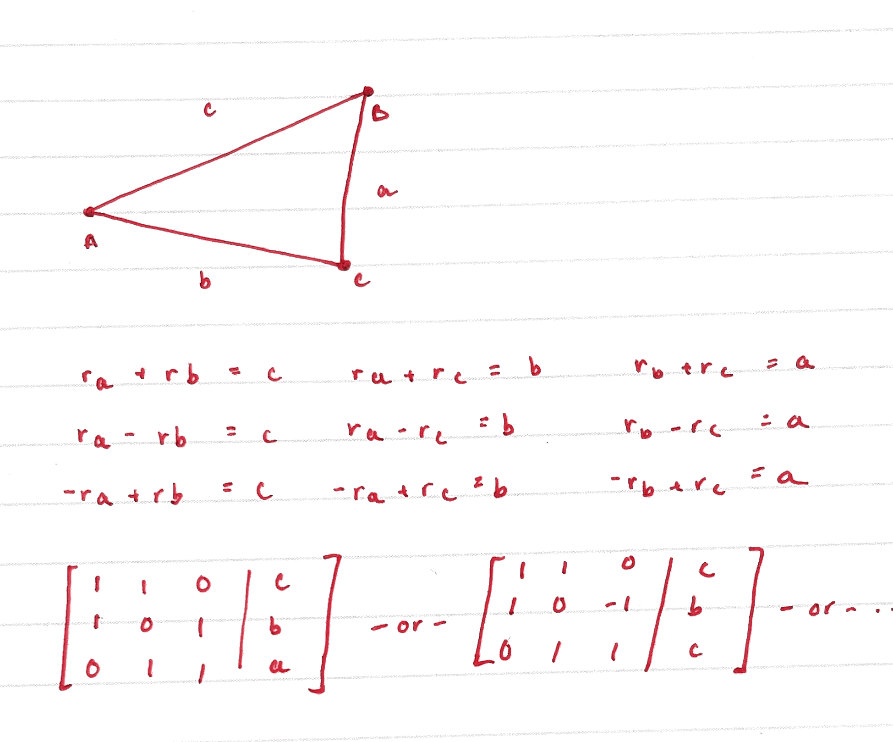

# Introduction
I started looking into the apollonian gasket after reading a Twitter post about it.  [INSERT TWITTER POST HERE]. It's hard not to be intrigued by these shapes, and of course, I thought it might be a quick and interesting mini project to try to generate them, and thought it would be nice to extend this to a three dimensional sphere fractal generation. But "quick" left the picture after I started to realize the complexities and rabbit holes in generating these fractals. This post is about some of the things I learned when trying to generate these fractals, setbacks, and the general process that I took. 

# Circle generation
In order to generate the spherical fractal, I wanted to start with the "easy" case: generating a classic 2D apollonian gasket. An Apollonian gasket is a type of fractal and I think the best definition is how it is generated:

1. Start with three mutually tangent circles (each circle is tangent to the others)
2. Add an "inner" circle tangent to the previous three and "outer" circle (also tangent to the previous three). Now the base of the fractal is complete.
3. In each triangular looking whitespace, draw a new circle tangent to the three bordering circles.
4. Repeat step three with the newly created circles and respective whitespaces.

I started from the very beginning (a very good place to start) and worked on generating the initial three circles. There's two primary things that define a circle: it's centroid and radius. My initial approach was to generate a random circle, and then find another circle that was tangent to the original, and then find a third. As I started with this approach, I found it becoming messy. I had to find either a second random centroid or radius (turns out a random centroid was a lot easier), and then find a third centroid and radius that intersected with the first two at exactly one point. The first step was turning out to be hard with this approach, and after seeing this image [http://www.malinc.se/math/geometry/apolloniangasketen.php]. I realized that it would be much easier to start with three random centroids, and then find the radii which would make the circles mutually tangent. 

Because some things are easier done on paper, here is how I solved the for the radii given centroids.

 

    
    
Solving for radii of circles given centroids

But, this aproach had an oversight -- nested circles. I was currently ignoring all cases where one circle was inside of the other. My solution would not be able to account for something like this.

 

    
    
Solving for radii of circles given centroids

Different combinations of radii have to be considered in order to fix this problem. Here's an illustration of the new cases added. 

 

    
    
Solving for radii of circles given centroids

There are $3^3=27$ different combinations of matrices to solve, but many do not have valid solutions. I wrote a small python script to go through all 27 cases and determine the solution (if one existed).  

 

    
    
Solving for radii of circles given centroids

Construction of three tangent circles with pen and paper. The inner adn outer circles couln't find out how to generate. 

Now, it was time to turn to the problem of generating the Soddy circles, or the inner and outer circles that are both tangent to the original three. My initial approach here was to consult the internet and ChatGPT. ChatGPT suggested a couple of times to use. 
