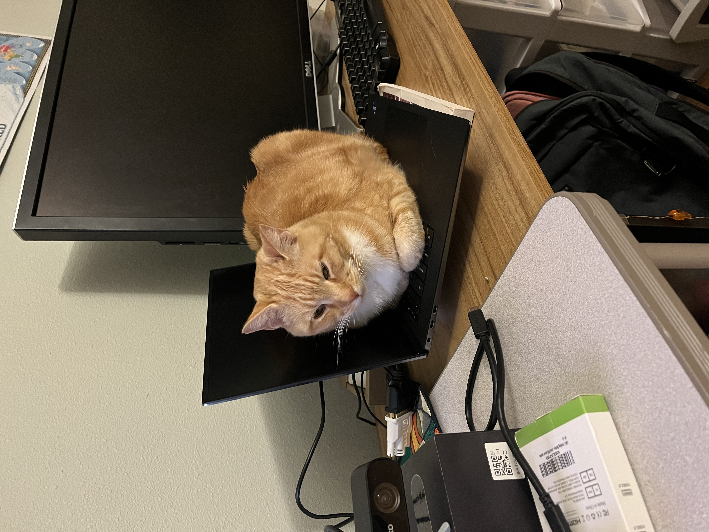
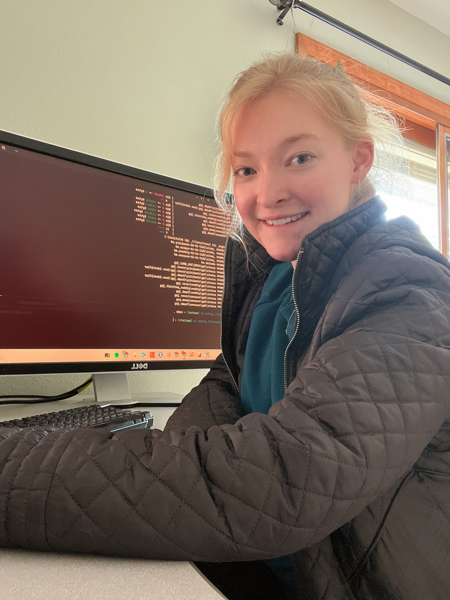

## `ifconfig`

World interfaces
```
email: flags = <UP, RUNNING> 
               churchill.aloha@gmail.com

youtube: flags = <UP, RARELY POSTING, USUALLY WATCHING>
                 @strange-loops

github: flags = <UP, PULLING, PUSHING>
                Aloha-Churchill

lo: flags = <UP, LOOPBACK, TRAIL RUNNING>
            inet: 127.0.0.1

```

## Words of wisdom and amusement
> "Cauliflower is just cabbage with a college education" ~ Mark Twain

> "Civilization advances by extending the number of important operations which we can perform without thinking of them" ~ Alfred North Whitehead

> “I was gratified to be able to answer promptly, and I did. I said I didn’t know.” ~ Mark Twain

> "There is no good or bad, but thinking makes it so" ~ Shakespeare

> "Clouds are not spheres, mountains are not cones, coastlines are not circles, and bark is not smooth, nor does lightning travel in a straight line" ~ Benoit Mandelbrot

> "Always forgive your enemies - nothing annoys them so much" ~ Oscar Wilde

> "It is better to do the right problem the wrong way than the wrong problem the right way." ~ Richard Hamming

> "Luck favors the prepared mind." ~ Pasteur

> “Clothes make the man. Naked people have little or no influence on society.” - Mark Twain

## Images are worth 1000 words
Blurry ones on sale for 500. 

<div style="display: flex; justify-content: center; text-align: center;">
    <div class="image" style="display: inline-block; margin-right: 20px;">
        
        <p></p>
    </div>
    <div class="image" style="display: inline-block;">
        
        <p></p>
    </div>
</div>
<div style="display: flex; justify-content: center; text-align: center;">
    <div class="image" style="display: inline-block; margin-right: 20px;">
        
        <p></p>
    </div>
    <div class="image" style="display: inline-block;">
        
        <p></p>
    </div>
</div>
<div style="display: flex; justify-content: center; text-align: center;">
    <div class="image" style="display: inline-block; margin-right: 20px;">
        
        <p></p>
    </div>
    <div class="image" style="display: inline-block;">
        
        <p></p>
    </div>
</div>
